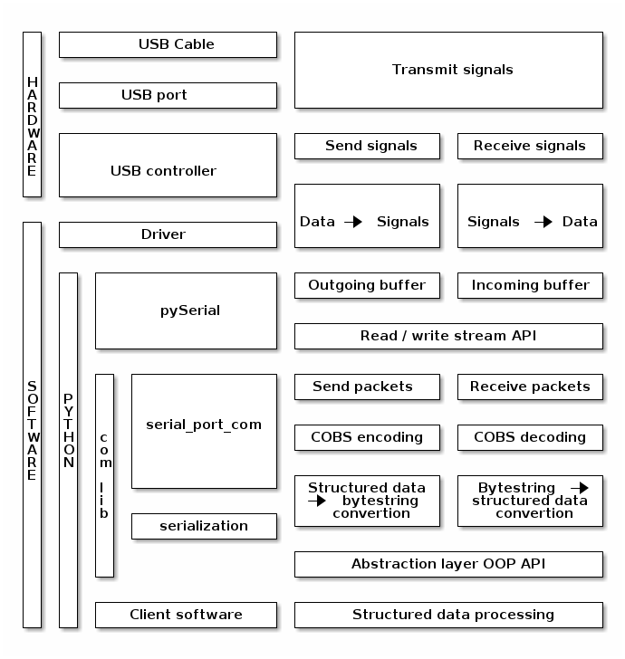

# DE000 General Design of the Library com_lib

## Intended Use and Functionality

This library is designed to provide object-oriented API as an abstraction layer between the **pySerial** library (treating serial port as a stream and operating with bytes) and the client software working with more abstract, more structured data types. The client software is supposed to provide some chunk of data, which is to be send as a single *package*. The response (if any) is supposed to be a *package*. Furthermore, the client software may operate as a pure *data provider* only sending some data or commands, whilst the other side doesn't send any responses, or they are ignored by the *provider*. Alternatively, the client software may operate as a pure *data consumer* simply listening to data coming from a different device. The third most common situation is synchronous bi-directional communication, when the client software requires and awaits a response to any send data package before it is able to proceed further.

Thus, the library **com_lib** is responsible for:

* *Atomic* data send and receive operations in form of *packages*
* Implementation of synchronous send-receive mode of communication
* Implementation of asynchronous mode of communication, when the requests to send or receive a package may be issued in any order
* Conversion of the data received from the client software into a package
* Conversion of the package received into a data in the format expected by the client software

Concerning the *packages* the design choice is to use *zero-terminated packages*. Basically, a package is an arbitrary length of non-zero bytes (1 <= byte\_value <= 255) followed by 0 value as the package terminator. This approach allows an arbitrary length of a package according to the amount of data to be transmitted. Furthermore, a sequence of *N* zeroes is treated as *N-1* empty packages following the last received non-empty package. Since zeroes are not allowed in a sequence of bytes to be send as a single package, the arbitrary bytestrings representing the actual data are COBS encoded before sending, and the received packages are COBS decoded.

In the asynchronous mode the **com_lib** library should send packages exactly in the same order as the respective data chunks are received. It should also accumulate and queue all received packages, and return them one at a time and exactly in the received order with each *receive package request*.

In the synchronous mode the **com_lib** must await a response to each sent package, which response should be returned to the client piece of software using the library. This mode implies that the other side always sends response on each received package. Thus, in the simplest form this mode is sending a packaging and awaiting a response until it is received and is to be returned to the caller, or until a timeout (threshold time interval between sending and receiving) is reached, which is *fault* situation.

However, the design decision is made to allow mixing synchronous and asynchronous communication in a single session. In such a situation it is difficult to differentiate between package received in response to the last (synchronously) sent package and the unclaimed responses to the previously asynchronously sent packages. In order to break the ambiguity the following procedure is applied assuming that the other side always sends response:

* Each package sent in either synchronous or asynchronous mode increments an internal *Sent* , which value is returned to the client software for book-keping
* Each received package increments internal counter *Received* and is queued together with the current value of that counter, until it is requested by and dispached to the client software
* In the asynchronous mode upon each *receive* request the incoming buffer is checked and all 'complete' packages are pulled out and queued. The first package awaiting in the queue is returned together with the coupled 'received index'; or nothing (None) is returned if the queue is empty
* In the synchronous mode the incoming buffer is repetitively pulled and the queue is populated until the timeout is reached or the values of the both *Sent* and *Received* counters become equal. If timeout is reached before the required response is received an exception should be raised to indicate a *fault* situation. Otherwise the last package in the queue is returned together with the corresponding index. In the both cases the packages remaining in the queue are discarded
* The asynchronous sending and package quering operations are virtually non-blocking, whereas the synchronous mode is blocking by design

Such design has no drawbacks if the synchronous or asynchronous mode is used exclusively during the session. It is beneficial in the case when the client software doesn't care about responses to some data sent, and it can spend some time in between sending to do something else without multi-threading. Only packages with the required response should be sent in the synchronous mode. However the synchronous and asynchronous modes can be mixed only if the communication is always bi-directional, otherwise the asynchronous mode should be used solely.

The [pySerial](https://pypi.org/project/pyserial/) operates with bytestrings, whereas the client software can provide data in the different format, thus it is also responsibility of the library **com_lib** to convert the data into a bytestring and to perform the reverse conversion of the received packages.

Thus, the intended use of the library is summarized in the diagram below


The next diagram illustrates the place of the library in the entire communication process



## Design Details

The next 3 diagrams illustrate the process flow of the asynchronous and synchronous data sending and receiving (as discussed in the previous section).


The *pySerial* library operates with bytestrings (Python type **bytes**), into which many native Python types can be easily converted or constructed from. For instance, an instance of **bytes** type can be initialized from an instance of **bytearray** or an usual string (**str**, Unicode) using a specific Unicode codec. Furthermore, a string can be directly encoded into a bytestring using the same codec. A bytestring can also be decoded into a usual string (using specific Unicode codec) or passed into the initialization method of a bytearray. The bytes representation of the integer (**int**) and floating point (**float**) numbers can be obtained with help of the Standard Library *ctypes*, which can also reconstruct native Python integer and floating point values from their bytes representation.

Concerning the compound data storage containes: containers (list, tuple, array, etc.), mapping types (associative arrays / dictionaries) and generic classes instances - the knowledge of their internal structure, i.e. convoluted introspection functionality, is required for the bytes packing and unpacking from the bytes. Furthermore, some of the data stored in a class instance may be related to the internal class mechanics, and should not be serialized and shared. Therefore, the serialization and deserialization should be delegated to the object in question. The *com_lib* library should recognize such objects capable of auto-serialization using 'HAS A' (duck typing) rather than 'IS A' (inheritance typing) approach. For instance, a class providing:

* Class method *unpackBytes*(data) : bytes -> type A, as the *constructor* for de-serialization
* Instance method *packBytes*() : None -> bytes, as the serialization method

In the majority of the use cases a device, to which communication is to be implemented, runs some embeded software / firmware written in C language or similar, which doesn't implement complex data transformation, but *casts* a sequence of bytes in the received data onto some type, and simply copies the byte representation of some type value into the byte sequence sent as a response.

For example, a bytestring b'\x01\x02' can be interpreted as 2 C **byte** or values 1 and 2, or a single **short** (**int16**) value 258 in big endinan byte order or 513 in little endian byte order. Therefore, in order to properly construct a data package to be sent a native Python scalar values (etc. integer, floating point) must be represented by the proper number of bytes and in the right order. The same consideration is applied to the inverse operation - interpretation of the response received.

In order to facilitate this tasks the library *com_lib* should implement *template* classes, which already are auto-serializable, and from which the custom classes can be created simply by describing the required data structure: C *stuct*-like (names and types of the fields) and C *array*-like (number and type of elements) objects.

The pseudo BNF definition below describes the data structures, which could be implemented by sub-classing these template classes:

```abnf
serializable    = fixed-array / dynamic-array / fixed-struct / dynamic-struct

fixed-array     = 1*(c-scalar / fixed-array / fixed-struct)

dynamic-array   = *(c-scalar / fixed-array / fixed-struct)

fixed-struct    = 1*(identifier (c-scalar / fixed-array / fixed-struct))

dynamic-struct  = fixed-struct (dynamic-struct / dynamic-array)
```

The *c-scalar* is a C primitive type, like **short** or **double**, etc. - with the Python implementation via the Standard Library *ctypes*; and *identifier* is a valid Python identifier, which can be used as name of an attribute or a key of a dictionary.

The packing and unpacking must be performed in the *depth-first* order, i.e. if a struct field or an array element is itself a compound object (not scalar), it must be packed / unpacked completely first before proceeding to the next field / element. This rule is applied recursively.

A dynamic array may be either the top level (the entire object) or the last part of the byte representation of a (nested) struct. Due to this arrangement an arbitrary and unknown *a priori* length dynamic array can be unambiguously unpacked, as long as the length of the entire bytestring or its tail (after unpacking all other fields of a struct) respectively is divisible by the byte-size of a single dynamic array element.
