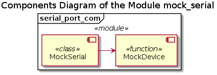
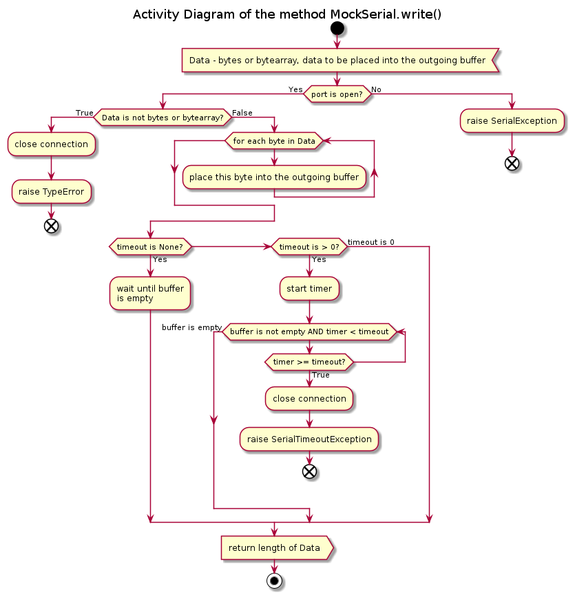
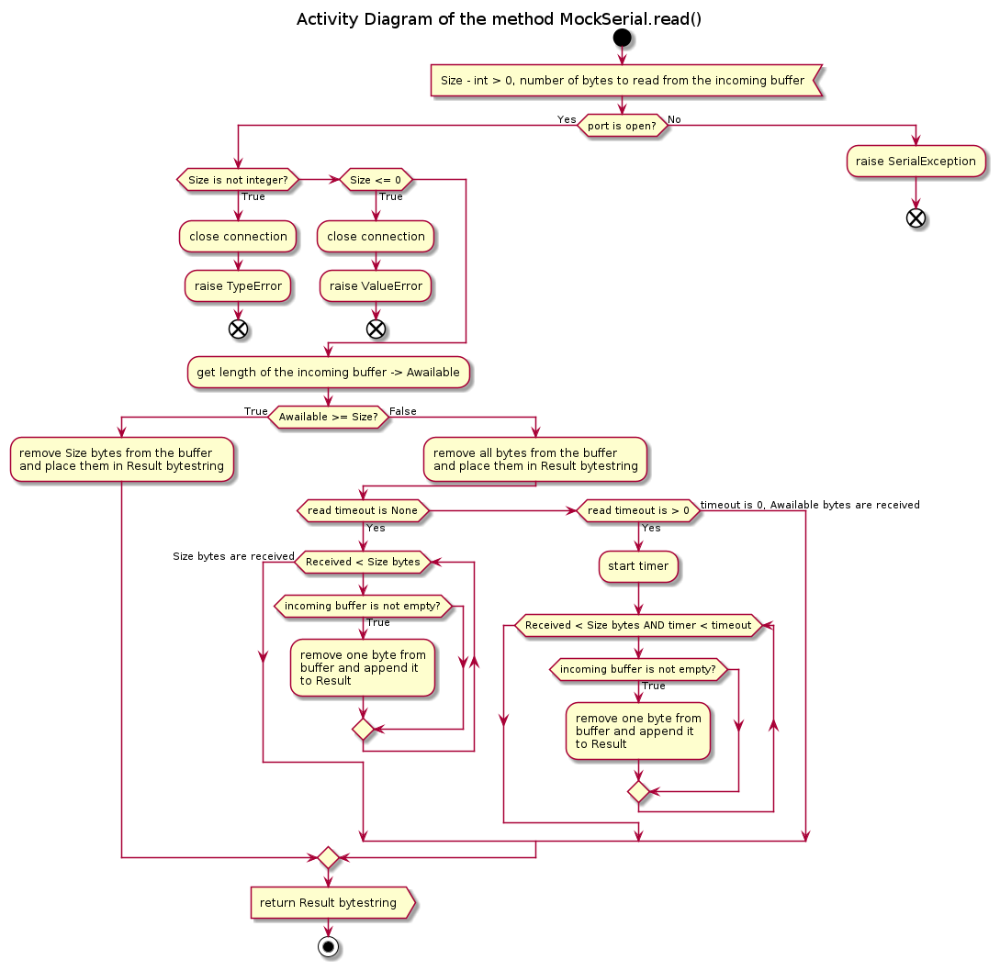
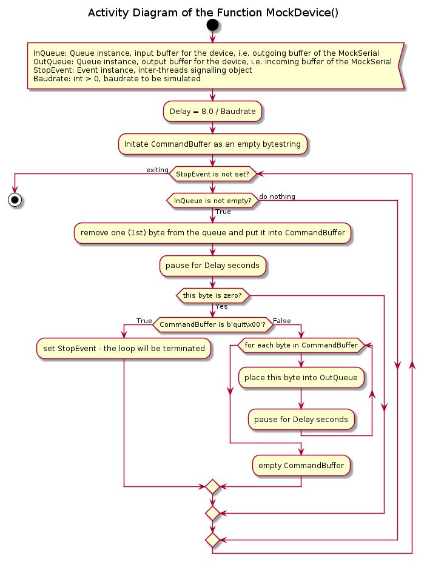

# UD001 User and API Reference for the Module mock_serial

## Scope

This document provides user reference on the module *com_lib.mock_serial*, including design, functionality, implementation details and API reference.

Functional components:

* Class **MockSerial**
* Function **MockDevice**

Note that this module is intended only for unit testing of the library. End users (not developers) should not use this module.

## Design and Functionality

This module provides a mock serial connection handler class **MockSerial**, which emulates the basic functionality of the **serial.Serial** class from the *pySerial* library, and it is designed for use in the unit testing. It can 'connect' to a mock device, which simply repeats back the bytestring zero-terminated packages sent into it.

The emulated functionality includes:

* Opening a connection by a string identifier of a port. The already open connection cannot be openned again - **SerialException** is raised. However, if the port was explicitely closed by the user request, or implicitely closed due to emulated disconnection, it can be safely re-openned.
* Closing the open connection. The already closed connection (or it never was open) cannot be closed - **SerialException** is raised.
* Blocking and non-blocking acquision of specific number of bytes from the incoming buffer with a specific *read* timeout
* Blocking and non-blocking sending of a bytestring with a specific *write* timeout
* Emulation of the slower or faster connections using the standard baudrates (same as recognized by *pySerial*)
* The port name, baudrate and both read and write timeouts can be passed as keyword arguments of the initializer method or defined later via the respective properties, but before openning the connection

The blocking / non-blocking reading and writing functions in the same way as in the *pySerial* library:

* Reading
  * Timeout is None - blocking call until exactly the requested number of bytes is acquired
  * Timeout is 0 - non-blocking call; as many as possible (present in the incoming buffer) but no more than the requested number of bytes is acquired and returned immediately
  * Time is a positive number - blocking call; the method will not return until the requested number of bytes is acquired or timeout is reached, at which point all acquired bytes are returned
* Writing
  * Timeout is None - blocking call; the passed bytestring is placed into the outgoing buffer, and the method doesn't return control until the outgoing buffer is empty (consumed by the mock device)
  * Timeout is 0 - non-blocking call; the passed bytestring is placed into the outgoing buffer, and the method returns control immediately
  * Timeout is a positive number - blocking call; the passed bytestring is placed into the outgoing buffer, and the method doesn't return control until the outgoing buffer is empty (consumed by the mock device) or timeout is reached - in the second case **SerialTimeoutException** is raised

In addition, a special command b'quit\x00' can be sent via the mock serial connection into the mock device in order emulate disconnection.

The mock device simply repeats back each zero-terminated package (bytestring), except for the 'kill command' (see above).

This functionality allows unit testing of the higher level *pySerial* wrapper objects at the different speed of the connection, and even a simulation of a disconnection event.

## Implementation Details

The components and class diagrams of the module are shown below

The class **MockSerial** can be instantiated without arguments, in which case both the read and write timeout are set to **None**, the baudrate is set to 9600 and the port name is not assigned. Alternatively, the class can be instantiated with one or more of the following *keyword* arguments:

* *port* - string value, 'mock' is the intended value
* *baudrate* - positive integer, any standard baudrate value recognized by *pySerial* library
* *timeout* - **None** or non-negative number (**int** or **float**), the read timeout
* *write_timeout* - **None** or non-negative number (**int** or **float**), the write timeout

These values can also be set via the setter properties with the same names *before* opening the port. Note, that the name of the port must be set before openning. These settings are stored in 'private' isntance attributes, which are interfaced by getter / setter properties, which perform data sanity checks on the values to be assigned and raise an exception when a check fails.

The list of the valid values for the *baudrate* is stored in the class 'private' attribute *_KnownBaudrates*, whereas the 'private' class attribute *_KnowPorts* stores a look-up table in form *port_name : **str** -> device_reference : **callable***.

Also during instantiation two instances of **Queue** class are created as the *outgoing* and *incoming* buffers, where each stored item is a single byte (bytestring of length 1) - and an instance of **Event** class to send signals between threads. An instance of **MockSerial** class is the *provider* for the *outgoing* buffer and the *consumer* for the *incoming* buffer.

A mock connection is created upon calling the instance method *open*(). Note, that is the port name is not set, or the connection is already openned, an exception is raised. Otherwise, a new thread is created, in which the *MockDevice* function is executed. The both buffers and the event signaling object are shared between the threads. Thus, the *MockDevice* function is the consumer of the outgoing buffer and provider for the incoming buffer. The baudrate value is also passed into the *MockDevice* function.

The method *close*() sets the signal event and awaits the termination of the 'device' thread. Note, that the **MockSerial** class ensures that the connection is closed and the 'device' thread is terminated before it raises an exception in any of its methods or properties.

The current status of the connection (is it open or not) can be queried via the read-only property *is_open*, whereas the read-only properties *in_waiting* and *out_waiting* return the number of bytes (elements of a queue) currently stored in the respective buffer.

The data can be sent using the method *write*() and received using the method *read*(). The first method accepts a bytestring or bytearray argument and returns its length, or raises an exception if the write timeout is reached before the content of the outgoing buffer is fully consumed by the mock device. The second method requires a positive integer value as its argument (number of bytes to read) and, depending on the value of the read timeout setting, returns either the exact number of bytes as a single bytestring, or shorter length bytestring, if the required number of bytes was not present in the incoming buffer and cannot be accumulated during the timeout period. Thus, the both methods emulate the performance of the respective methods of the **serial.Serial** class from the *pySerial* library (see diagrams below).

The *MockDevice*() function is executed in a separate thread, which is created upon 'openning' of a connection. This function runs in an indefinite loop until the signaling event is set by the mock serial object, or the special 'kill' command is received. In each cycle it queris the outgoing buffer of the mock serial object and, if it is not empty, removes the first byte from the queue and introduces a delay inversly proportional to the set baudrate (slow / fast transfer speed emulation), whereas the removed byte is accumulated in the internal cache of the function.

As soon as a zero-valued byte is received (package terminator) the function pauses the listening. If the accumulated bytes form the 'kill' command, the function sets the signaling event and exits the loop, thus terminating the thread. Otherwise, it puts all accumulated bytes one at a time into the incoming buffer and introduces the same delay after each byte. Then it clears the cache and resumes the listening.

In short, this function emulates the sending / receiving as the different transfer rates and simply repeats back the received data.

## API

### Functions

**MockDevice**(InputQueue, OutputQueue, StopEvent, Baudrate)

*Signature*:

queue.Queue, queue,Queue, threading.Event, int > 0 -> None

*Args*:

* *InputQueue*: **queue.Queue**; input buffer (from the device's perspective), from which the commands are to be read

* *OutputQueue*: **queue.Queue**; output buffer (from the device's perspective), into which the response to a command is to be written

* *StopEvent*: **threading.Event**; an object signaling the function to terminate if set

* *Baudrate*: **int** > 0; emulation of the different data transfer rates, i.e. introduces a delay of 8.0 / Baudrate between each byte read from the input and send to the output

*Description*:

Emulation of a simple device, which repeats back every command send, until the stop event is not set externally or b'quit' command is received. Note that b'\x00' is used as the terminator between the commands, and it is also send back. The response to the b'quit' command is not sent.

This function is designed to be executed in a separate thread.

### Classes

#### Class MockSerial

*Description*:

Emulation of the minimal API compatible with the **serial.Serial** class, see PyPI library *pySerial*. Executes the function *MockDevice*() in a separate thread upon calling the method *open*(); one should assign *port* = 'mock' first. This approach simulates a real serial port connection to a device, which echoes back the send data. Thus the blocking and non-blocking reading and writing at the different baudrates can be safely tested.

***Properties***:

* *is_open*: (read-only) **bool**
* *in_waiting*: (read-only) **int** >= 0
* *out_waiting*: (read-only) **int** >= 0
* *port*: **str** OR **None**
* *baudrate*: **int** > 0
* *timeout*: **int** >= 0 OR **float** >= 0 OR **None**
* *write_timeout*: **int** >=0 OR **float** >= 0 OR **None**

***Instantiation***:

**\_\_init\_\_**(\*\*kwargs)

*Signature*:

/\*\*kwargs/ -> None

*Raises*:

* **TypeError**: inappropriate data type of a recognised keyword argument
* **ValueError**: inappropriate value of a proper data type of a recognized keyword argument
* **serial.SerialExeption**: unknown port value (string)

*Description*:

Initialization. Creates instance attributes and sets the connection settings according to the passed keyword arguments values, which can include:

* *port* - None or str
* *baudrate* - integer, any standard baudrate, e.g. 50, 9600, 115200
* *timeout* and *write_timeout* - None or non-negative integer or float

If the known value is assigned to the port (e.g. 'mock') the connection to the mock device is openned automatically.

***Methods***:

**open**()

*Signature*:

None -> None

*Raises*:

**serial.SerialException**: the port is already opened

*Description*:

Method to (re-) open a connection to the assigned port. It is called automatically if the *port* = 'mock' is passed into the initialization method, or the same value is assigned to the property port directly.

**close**()

*Signature*:

None -> None

*Raises*:

**serial.SerialException**: the port is already closed

*Description*:

Closes the currently active connection.

**read**(size = 1)

*Signature*:

/int >= 1/ -> bytes

*Args*:

*size*: (optional) **int** > 0; maximum number of bytes to read from the incoming buffer, defaults to 1

*Returns*:

**bytes**: the read-out data

*Raises*:

* **TypeError**: passed argument is not an integer
* **ValueError**: passed argument is an integer but not positive
* **serial.SerialException**: the port is not open

*Description*:

Pulls the incoming buffer for available data and returns the result as a bytestring. The requested number of bytes to obtain is passed via the optional argument. However, the number of bytes actually returned depends on the status of the incoming buffer and the value of the property timeout:

* *timeout* = None; blocking call, the buffer is pulled indefinitely until exactly 'size' bytes are acquired
* *timeout* = 0; non-blocking call - if there are more than or equal to 'size' bytes in the buffer, exactly 'size' bytes are pulled and returned, otherwise all available (< 'size') are returned; in any case - exits almost immediately
* *timeout* > 0; tries to pull exactly 'size' bytes from the incoming buffer and return them, but if less bytes are obtained during the 'timeout' period, only the already pulled bytes are returned

**write**(Data)

*Signature*:

bytes -> int >= 0

*Args*:

*Data*: **bytes**; bytestring to be sent

*Returns*:

**int** >= 0: number of bytes written into the outgoing buffer, i.e. the length of bytestring argument

*Raises*:

* **TypeError**: passed argument is not a bytestring
* **serial.SerialException**: the port is not open
* **serial.SerialTimeoutException**: timeout is reached while sending

*Description*:

Puts all bytes from the passed bytestring into the outgoing buffer. The further behavior is defined by the set baudrate and write_timeout:

* *write_timeout* = None; blocking call, waits indefinetely until the outgoing buffer is emptied
* *write_timeout* = 0; non-blocking call returns immediately
* *write_timeout* > 0; waits until the outgoing buffer is emptied, but no longer than 'write_timeout' - if the timeout is reached, raises an exception
