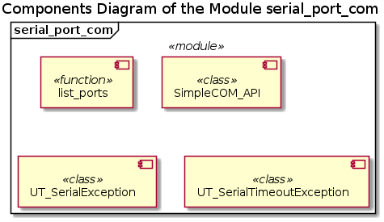
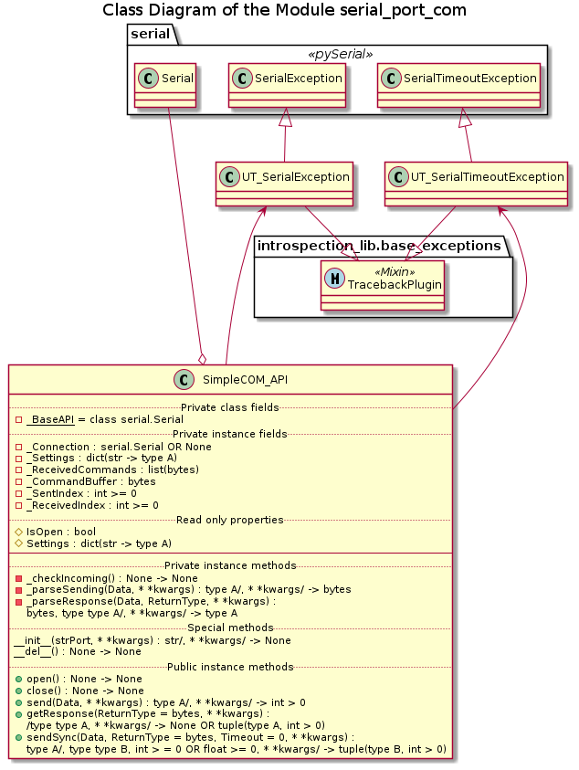

# UD002 User and API Reference for the Module serial_port_com

## Scope

This document provides user reference on the module *com_lib.serial_port_com*, including design, functionality, implementation details and API reference.

Functional components:

* Function *list_port*()
* Class **SimpleCOM_API**
* Custom exception classes **UT_SerialException** and **UT_SerialTimeoutException**

## Design and Functionality

This module implements *atomic* sending and receiving of data over serial port connection using zero-terminated packages - the COBS-encoded bytestrings with the added b'\x00' byte. The supported modes of operation are:

* Asynchronous communication
  * Uni-directional
    * Only sending with the responses being ignored / not claimed, even if any is issued
    * Only listening to an external data provider
  * Bi-directional - sending packages and checking for the incoming data / acquiring the received data in an arbitrary order
* Synchronous communication - bi-directional by definition, when for each sending the response is waited for and reclaimed - the other side MUST send a response to each received data package
* Mixing the synchronous and asynchronous sending and receiving - the other side MUST send a response to each received data package

Note, that in the mixed mode some responses to the asynchronous sendings may be lost depending on the sequence of the send / received requests made, whereas for each synchronous sending the retrieval of the response is guaranteed.

The synchronous send and receive can be performed in the blocking mode or in the timeouted mode. In the blocking mode the control is not returned to the caller until the respose is received, however long it may take. In the timeouted mode the connection is automatically closed and the **UT_SerialTimeoutException** is raised.

Although the actual packages are sent and received as bytestrings, different data types are acceptable as data to be send:

* Bytestring (Python type **bytes**) - no additional data conversion is applied except for the COBS encoding before sending
* Byte arrays (Python type **bytearray**) - simply repacked as bytestrings before encoding
* Unicode strings (Python type **str**) - encoded into a bytestring using 'utf-8' codecs, then COBS encoded
* Any object (class instance) with an instance method *packBytes*(), which is called without an argument and returns a bytestring; that returned bytestring is COBS encoded before sending

The tailing zero-terminator is automatically stripped in the received packages, which are than COBS decoded and returned to the caller. However, a different return data type can be requested:

* **bytearray** (as type, not value) - an instance of the byte array is created from the received bytestring and returned
* **str** (as type, not value) - the bytestring is 'utf-8' decoded into a Unicode string, which is returned
* a user defined class (as **type**, not instance as **object**), which has a class method *unpackBytes*() accepting a single bytestring argument and returning any value, which will be passed to the caller

## Implementation Details

The components diagram of the module is below.

The function *list_ports*() analizes the data returned by the function *serial.tools.list_ports.comports*() and selects only those entries, for which both vendor and product IDs are not None. The selected entries are returned as a list of 3-elements tuples in the format (port_path: str, VID: int, PID: int).

The next illustration is the class diagram of the module.

The classes **UT_SerialException** and **UT_SerialTimeoutException** sub-class the respective **serial.SerialException** and **serial.SerialTimeoutException** exceptions, and mix them with the **introspection_lib.base_exceptions.TracebackPlugin** class, thus enabling the enhanced traceback analysis functionality via the added read-only property *Traceback*.

The class **SimpleCOM_API** wraps functionality of the class **serial.Serial**. Note, that the said class is stored (by reference, as a type) in the 'private' class attribute *_BaseAPI*, and instantiation of the wrapped class occurs only upon instantiation of the **SimpleCOM_API** class itself. Therefore, a sub-class of the **SimpleCOM_API** can simply change the value of the *_BaseAPI* attribute to interface another implementation of the serial communication. For instance, in the unit tests made for this module, the mock serial class **com_lib.mock_serial.MockSerial** is interfaced instead of **serial.Serial**. However, the replacement interface must provide minimum compatibility API:

* Readable field / property attributes:
  * *is_open*: **bool**
  * *in_waiting*: **int** >= 0
* Writeable field / property *baudrate*: **int** >= 0
* Instance method *write*() accepting a single bytestring argument
* Instance mehtod *read*() with the signature **int** >0 -> **bytes**

The initialization method of the **SimpleCOM_API** requires a string argument - the path to the port to open, with additional connection settings can be passed as keyword arguments, supported by the initialization method of the **serial.Serial** class. Note, that the passed values for *timeout* (read) and *write_timeout* (write) are ignored and replaced by 0.

The connection is established directly upon instantiation of the class; and the connection is closed by calling the method *close*(). However, the closed connection can be re-openned with the method *open*(). Unlike the standard behaviour of the **serial.Serial** class an attempt to close a closed connection or to open the already open connection is not an error - an exception is not raised, and the request is simply ignored.

The connection must be in the 'open' state (use read-only property *IsOpen* to check) in order to send and / or receive the data; otherwise **UT_SerialException** is raised.

## API

### Functions

**list_ports**()

_Signature_::

None -> list(tuple(str, int, int))

_Returns_::

**list**(tuple(str, int, int)); list of 3-element tuples, where the first element is the port name / path, the second - the vendor ID, and the last - the product ID

_Description_::

Looks up the connected via USB device, to which the virtual serial port communication can be established.

### Classes

#### SimpleCOM_API

_**Descritpion**_

Wrapper class for the **serial.Serial** class - serial port connection API from the library *PySerial*. Implements simple API for asynchronous and synchronous data exchange using zero terminated bytestrings. Keeps track of the number of the sent and received packages. As long as the connected device sends a response to each received package, the both asynchronous and synchronous modes can be mixed.

Requires the path to the port during instantiation. Other connection settings except for the port path, read and write timeouts can be passed as the keyword arguments. The connection settings cannot be changed afterwards, but the port can be closed and re-opened multiple times upon request.

_**Properties**_:

* *IsOpen*: (read-only) bool
* *Settings*: (read-only) dict(str -> type A)

_**Instantiation**_:

**\_\_init\_\_**(strPort, \*\*kwargs)

_Signature_:

str/, \*\*kwargs/ -> None

_Args_:

* *strPort*: **str**; path to the port to be opened
* *kwargs*: (keyword) type A; any number of the keyword arguments acceptable by the **serial.Serial** class initializator

_Raises_:

* **UT_SerialException**: the connection cannot be opened, e.g. a device cannot be found or configured
* **UT_TypeError**: port path is not a string, OR any of the keyword arguments is of the improper type
* **UT_ValueError**: any of the keyword arguments is of a proper type, but of an unacceptable value

_Description_:

Initializer. Additional connection settings, like baudrate, etc. can be passed as keyword arguments, however the values of the keyword arguments port, timeout and write_timeout are replaced by the value of the positional argument, 0 and 0 respectively even if they are present among the keyword arguments. The connection is opened automatically.

If sub-class overrides this method, it must call this 'super' version.

_**Methods**_:

**open**():

_Signature_:

None -> None

_Raises_:

**UT_SerialException**: the connection cannot be opened, e.g. a device cannot be found or configured

_Description_:

Attempts to open a connection using the stored settings if it is not open at the moment.

The sub-classes should not re-define this particular method.

**close**():

_Signature_:

None -> None

_Description_:

Closes the connection if it is open. Doesn't raise an exception on closing the already closed connection. The cached data is cleared.

The sub-classes should not re-define this particular method

**send**(Data, \*\*kwargs):

_Signature_:

type A/, \*\*kwargs/ -> int > 0

_Args_:

* *Data*: type A; data to be processed and send
* *kwargs*: (keyword) type B; any additional arguments

_Returns_:

**int** > 0; the sent package index

_Raises_:

* **UT_TypeError**: the passed data is of the unsupported type
* **UT_SerialException**: the connection cannot be opened, e.g. a device cannot be found or configured, OR it has been disconnected in the process

_Description_:

Converts the passed data into a COBS encode bytesting, adds b'\x00' terminator and sends it into the port. The currently supported data types are: Unicode strings, bytestring, byte-arrays and instances of class providing own bytestring packing method *packBytes*().

The method is non-blocking. It exists immediately and returns the sent package index. There is no guarantee that the sending is already finished or even succeeded at this point.

The sub-classes should not re-define this particular method.

**getResponse**(ReturnType = bytes, \*\*kwargs):

_Signature_:

/type type A, \*\*kwargs/ -> None OR tuple(type A, int > 0)

_Args_:

* *ReturnType*: (optional) type type A; the data type, into which the the response should be converted; defaults to bytes
* *kwargs*: (keyword) type B; any additional arguments

_Returns_:

* **None**: there is no complete package waiting at the moment
* **tuple**(type A, int > 0); the 2-element tuple consisting of the received data converted into the required data type and the received data package index

_Raises_:

* **UT_TypeError**: the **ReturnType** is unsupported data type
* **UT_SerialException**: the connection cannot be opened, e.g. a device cannot be found or configured, OR it has been disconnected in the process

_Description_:

Checks the received and unclaimed responces and returns the earliest received response. The bytestring is converted into the requested data type / class instance. The method is not blocking. The currently supported data types are: Unicode strings, bytestring, byte-arrays and classes providing own bytestring unpacking class method *unpackBytes*().

The sub-classes should not re-define this particular method.

**sendSync**(Data, ReturnType = bytes, Timeout = 0, \*\*kwargs):

_Signature_:

type A/, type type B, int > = 0 OR float >= 0, \*\*kwargs/ -> tuple(type B, int > 0)

_Args_:

* *Data*: type A; data to be processed and send
* *ReturnType*: (optional) type type B; the data type, into which the the response should be converted; defaults to bytes
* *Timeout*: (optional) **int** >= 0 OR **float** >= 0; the timeout period; defaults to 0, i.e. blocking call
* *kwargs*: (keyword) type C; any additional arguments

_Returns_:

**tuple**(type A, int > 0); the 2-element tuple consisting of the received data converted into the required data type and the received data package index

_Raises_:

* **UT_TypeError**: the passed data is of the unsupported type
* **UT_SerialException**: the connection cannot be opened, e.g. a device cannot be found or configured, OR it has been disconnected in the process

_Description_:

Converts the passed data into a COBS encode bytesting, adds b'\x00' terminator and sends it into the port. When it waits until the reply to this sending is received. Unclaimed responses to the previous sendings are discarded in the process. By default (zero timeout) the call is blocking. If a positive timeout is specified, an exception is raised if the response is not received during this time interval. The received bytesting is converted into an instance of the requested data type / class.

The currently supported input data types are: Unicode strings, bytestring, byte-arrays and instances of class providing own bytestring packing method *packBytes*().

The currently supported return data types are: Unicode strings, bytestring, byte-arrays and classes providing own bytestring unpacking class method *unpackBytes*().

The sub-classes should not re-define this particular method.
