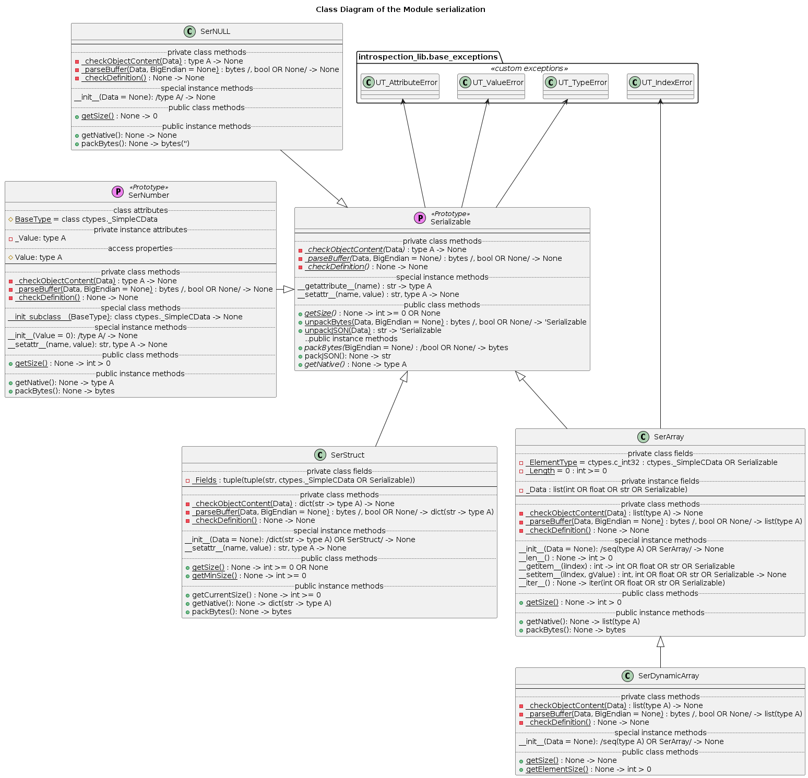

# UD003 User and API Reference for the Module serialization

## Scope

This document provides user reference on the module *com_lib.serialization*, including design, functionality, implementation details and API reference.

Functional components:

* Helper function *IsC_Scalar*()
* Helper functions *Scalar2Bytes*(), *Scalar2BytesNE*(), *Scalar2BytesLE*() and *Scalar2BytesBE*()
* Helper functions *Bytes2Scalar*(), *Bytes2ScalarNE*(), *Bytes2ScalarLE*() and *Bytes2ScalarBE*()
* Class **SerNULL**
* Class **SerStruct**
* Class **SerArray**
* Class **SerDynamicArray**
* Class **SerNumber**

## Design and Functionality

This module provides 'template' classes, from which self-serializing and de-serializing custom data type classes can be created simply be declaring the desired data structure. All instances of such custom sub-classes are guaranteed to retain exactly the same data structure. For the C *struct*-like objects it translates into the same number and names of the fields as well as the data types of the respective fields. All instances of C *fixed length array*-like class will have exactly the same number of elements of exactly the same data type. In the case of *dynamic arrays* the data type of the elements is fixed for all instances of the same class, whereas their number is defined during the instantiation or de-serialization; the length may differ between the instances of the same class, but it cannot be changed during the life-time of an instance.

The attribute resolution scheme for the implemented classes is modified such, that a new *instance attribute* cannot be created, e.g. an assignment to a non-existing attribute is prohibited (exception is raised). This functionality is especially relevant for the C *struct*-like objects, when a value cannot be assigned to a not declared field due to a typo in the code. Otherwise, data loss will occur during serialization.

All concerned classes provide the unified API:

* Initialization without an argument - all 'end nodes' are initialized with the default values of the corresponding *ctypes* classes
* Initialization with a single argument of the compatible data type and structure - as non-greedy *copy constructor*
* Class methods
  * *unpackBytes*() - *constructor* from the bytes representation of the data
  * *unpackJSON*() - *constructor* from the JSON string representation of the data
* Instance methods
  * *getNative*() - returns a native Python data types representation of the data stored in the instance, which is constructed only from **None**, **int**, **float**, **str** (ASCII 1 elemenent string), **bytes** (single byte, 1 element bytestring), **list** and **dict**
  * *packJSON*() - returns a JSON encoded string representation of the data returned by the method *getNative*()
  * *packBytes*() - returns a bytestring representing the stored data in byte format native to the declared C primitive typed fields / elements without computer word-padding, i.e. each 'end node' is represented by exactly the same number of bytes, which are required for the representation of the corresponding C primitive data type value

Thus, the custom sub-classes of these classes can be used directly with the class **serial_port_com.SerialCOM_API** as auto-serializable and de-serializable data types.

The class **SerNULL** is the only class that can be used as it is without sub-classing. It represent None / NULL value, i.e. its:

* native Python representation is **None** value
* JSON string representation is "NULL"
* bytestring representation is an empty bytestring b''

This class is provided for a specific application, when a package to be send or received can be constructed in a generic form of a fixed length *header* (e.g. a command code, or receipt acknoledgement / result code) plus a variable length *data payload*. If a command / response doesn't contain any *data payload*, the absense of an actual data can be accounted for in the generic package processing with an instance of **SerNULL** class.

The classes **SerStruct**, **SerArray** and **SerDynamicArray** must be sub-classed before use; whereas the sub-classes should only declare the desired data structure via 'private' class attributes.

On order to defice a specific data structure of a C struct-like object the sub-class of **SerStruct** must be created, and the names and data types of its fields must be declared in the class attribute *_Fields*, which must be a tuple of 2-elements tuples (field_name, field_type), e.g.

```python
class MyStuct(SerStruct):
    _Fields = (
        ("a", ctypes.c_short),
        ("b", ctypes.c_double)
    )
```

The names of the fields must be strings ('IS A' check) and proper Python identifiers (not checked), so they can be accessed in the code using the standard 'dot notation'. The fields data types can be ('IS A' check):

* For all fields except the last declared
  * C primitive data type (*ctypes* classes)
  * fixed length array
  * nested struct not containing a dynamic array
* For the last declared field
  * all types above, and
  * dynamic length array
  * nested struct containing a dynamic length array

This definition is applied recursively to the nested struct fields, thus any struct type can contain maximum one dynamic array.

In order to declare a fixed length array type the sub-class of **SerArray** must be created, and the type of the elements declared in the class attribute *_ElementType*, whilst the length of the array (number of elements) - in the class attribute *_Length*, e.g.

```python
class MyArray(SerArray):
    _ElementType = ctypes.c_int
    _Length = 10
```

The length of an array must be a positive integer number ('IS A' check), whereas the element type can be ('IS A' check):

* C primitive data type (*ctypes* classes)
* fixed length array
* nested struct not containing a dynamic array

The sub-class of **SerDynamicArray** must declare only the type of the elements as

```python
class MyDArray(SerDynamicArray):
    _ElementType = ctypes.c_int32
```

whereas the element type can be ('IS A' check):

* C primitive data type (*ctypes* classes)
* fixed length array
* nested struct not containing a dynamic array

The 'IS A' check for C primitive data type is implemented via *issubclass*() built-in function with respect to the **ctypes._SimpleCData** class, which allows the following *ctypes* classes:

* Compatible with the native Python **int** type:
  * c_byte / c_int8
  * c_ubyte / c_uint8
  * c_short / c_int16
  * c_ushort / c_uint16
  * c_int / c_int32
  * c_uint / c_uint32
  * c_long / c_ssize_t / c_longlong / c_int64 (64-bit platforms)
  * c_ulong / c_size_t/ c_ulonglong / c_uint64 (64-bit platforms)
* Compatible with the native Python **float** type:
  * c_float (4 bytes)
  * c_double (8 bytes)
  * c_longdouble (16 bytes)
* Compatible with the native Python **bool** type:
  * c_bool (1 byte)
* Compatible with the native Python **str** type (1 character only):
  * c_wchar (4 bytes)
* Compatible with the native Python **bytes** type (1 character only):
  * c_char (1 byte)

Note that the *ctypes* classes **c_char_p**, **c_wchar_p** and **c_void_p** will also pass the check, but they are not intended to be used.

These classes implement the data structure declaration sanity self-check functionality, which is automatically performed during instantiation of the class or then a class method is called on the class (without instantiation). If the data stucture declaration is not correct an exception is raised.

In the processes of the byte packing and unpacking the compound data types are traversed in the 'depth first' order, i.e. a field / element of the compound data type is processed completely before proceding to the next field / element. For instance, consider the following definitions

```python
class Point(SerStruct):
    _Fields = (
        ("x", ctypes.c_float),
        ("y", ctypes.c_float)
    )

class Triangle(SerArray):
    _ElementType = Point
    _Length = 3

class Shape(SerStruct):
    _Fields = (
        ("id", ctypes.c_uint),
        ("vrx", Triangle)
    )
```

The data structure of the class **Shape** is *flattened* into a sequence

```python
    {id, vrx[0].x, vrx[0].y, vrx[1].x, vrx[1].y, vrx[2].x, vrx[2].y}
```

Thus, the (nested) C primitive data type elements / fields are the 'end nodes' ('leaves') and the nested struct / arrays typed elements / fields are the 'branches' in the tree representation of the data structure of a compound data type. The byte packed representation of such object is constructed only from the 'leaves', however, their order is determined by their position within the 'branches'.

With this design a dynamic array nested within a stuct will be represented by the tailing elements of the *flattened* data structure, regardless of the depth of its nesting. Therefore, both the fixed length and the dynamic length compound data types can be serialized into and de-serialized from a bytestring unambiguously and without data loss. In other word, a new instance created by de-serialization of the serialized state of another instance of the same class will be the exact copy of the initial object.

The sub-classes of **SerStruct**, **SerArray** and **SerDynamicArray** can be instantiated without arguments (default constructor), in which case:

* An instance of a dynamic array is created empy - i.e. of the length 0
* An instance of a fixed length array is created with the declared number of elements, and each element being of the declared type
  * All 'leaves' in the flattend data structure are initialized with the default values for the corresponding *ctypes* classes
* An instance of a struct class is created with the declared number of fields, and each field having the declared name and being bound to the declared data type
  * The nested dynamic array is created empty
  * The rest of the 'leaves' in the flattend data structure are initialized with the default values for the corresponding *ctypes* classes

These classes also support *copy constructor* concept, i.e. state of another object can be used to (partially) define the state of a new object being created.

In the case of struct objects (sub-classes of **SerStruct**) the following rules are applied:

* The argument must be of a mapping type (e.g. Python **dict**) or an instance of any sub-class of **SerStruct**
* Fields / keys found in the passed argument, but not declared among the fields of the class being instantiated are ignored
* The declared fields of the class not found amongst the fields / keys of the passed argument are initialized with the default values
* If the declared fields of the class are also found amongst the fields / keys of the passed argument:
  * If the the value of the corresponding field / key of the passed object is compatible with the declared type of the field of the class beinging instantiated, this value is passed into the corresponding field constructor (copied)
  * Otherwise - an exception is raised to indicate the mismatching data structure

For the sub-classes of **SerArray** (fixed length arrays) the rules are:

* The argument must be of a sequence type (e.g. Python **list** or **tuple**) or an instance of any sub-class of **SerArray**, including sub-classes of **SerDynamicArray**
* If the declared length of the array *N* and the length of the passed argument is *M*, then
  * *N* >= *M*
    * all elements of the passed argument must be compatible with the declared elements type of the array
    * The first *M* elements of the array are initialized with the values of the respected elements of the passed argument
    * The remaining *N-M* elements of the array are initialized with the default values
  * *N* < *M*
    * the first *N* elements of the passed argument must be compatible with the declared elements type of the array
    * all elements of the array are initialized with the values of the respected elements of the passed argument

In the case of **SerDynamicArray**:

* The argument must be of a sequence type (e.g. Python **list** or **tuple**) or an instance of any sub-class of **SerArray**, including sub-classes of **SerDynamicArray**
* All elements of the passed argument must be compatible with the declared elements type of the array
* For the length of the passed argument *M* the array is created with exactly *M* elements, and each element is initialized with the value of the corresponding element of the passed argument

The specific restrictions on the length of a bytestring are applied, when it is used as the argument of the byte unpacking (de-serialization) method:

* **SerStruct** sub-classes
  * Fixed length, i.e. *getSize*() -> **int** > 0 - the length of the bytestring must be equal to the value returned by the *getSize*() method
  * Dynamic length, i.e. *getSize*() -> **None** - the length of the bytestring must be of, at least, the value returned by the *getMinSize*() method, with the length of the remain part being either 0 or divisible by the byte size of the (nested) dynamic array element
* **SerArray** direct sub-classes (fixed length) - the length of the bytestring must be equal to the value returned by the *getSize*() method
* **SerDynamicArray** sub-classes (dynamic length) - the length of the bytestring must be divisible by the byte size of an element, which can be obtained with the class method *getElementSize*()

In the case of the de-serialization from a JSON string the rules are:

* **SerStruct** sub-classes
  * the JSON string must be de-serializable into **dict** Python type, i.e. "{ ... }"
* **SerArray** direct sub-classes (fixed length)
  * the JSON string must be de-serializable into **list** Python type, i.e. "[ ... ]"
  * it can contain only the elements, which are de-serializable into a native Python data type compatible with the declared type of the array's elements
  * the number of elements must be equal to the declared length of the array
* **SerDynamicArray** sub-classes (dynamic length)
  * the JSON string must be de-serializable into **list** Python type, i.e. "[ ... ]"
  * it can contain only the elements, which are de-serializable into a native Python data type compatible with the declared type of the array's elements

Finally, the class **SerNumber** is added to support simple, scalar, numerical values such as the native C data types **byte**, **short**, **unsigned long int**, etc. Concerning the serialization into a bytestring or de-serialization form a bytestring such scalars can be functionaly implemented as a single element fixed length array or a single field structure. However, their native and JSON representation will be a list and a dictionary respectively, which is not very convenient. Note, that the class **SerNumber** cannot be instantiated, but it is designed to be used as a meta-class, as in the example below.

```python
#create a custom sub-class
class CType_uint16(SerNumber, BaseType = ctypes.c_ushort):
    pass

#instantiate it, C type cast is applied automatically
CTypedValue = CType_uint16(-3456) #negative -> conjugate

#access the stored data
print(CTypedValue.Value) #>> 62080

#modify the stored value, C type cast is applied
CTypedValue.Value = 100000 #greater than 2^16 -> only lower 16-bits are taken
print(CTypedValue.Value) #>> 34464
```

Naturally, any other **ctypes** numeric type can be used as the base type.

## Implementation Details

The components diagram of the module is shown below.


All functions defined in the module are 'helper' functions for the defined classes; however their functionality can be usefull in many situations, so it is implemented in the form of functions instead of the methods of the classes. Note that they do not perform the input data sanity checks, therefore, use with caution.

The function *IsC_Scalar*() returns **True** only if the passed argument is a sub-class of **ctypes._SimpleCData** (but not an instance, i.e. **type** not **object**). Otherwise it returns **False**.

The functions *Scalar2BytesNE*(), *Scalar2BytesLE*() and *Scalar2BytesBE*() return the bytestring representation of a native Python scalar value (e.g. **int** or **float** type value) according to specific C data type internal structure in the platform native, forced little endian and forced big endian byte order. For instance, the native Python integer value 1 is represented as b'\x01\x00' for C **int16** (**short**) type with the little endianness, but as b'\x00\x00\x00\x01' for **int32** (**long**) with the big endianness. Note, that the passed native Python value must be compatible with the passed **ctypes** type (class) initialization method optional argument. The function *Scalar2Bytes*() is a wrapper, which calls one of the functions above based on the values of the optional argument.

The functions *Bytes2ScalarNE*(), *Bytes2ScalarLE*() and *Bytes2ScalarBE*() perform the inverse operation, they convert a bytestring into a native Python scalar value, assuming that the passed bytestring contains the platform native, forced little endian and forced big endian byte order respectively byte representation of the value of a specific C type, which is passed as the second argument. The function *Bytes2Scalar*() is a wrapper, which calls one of the functions above based on the values of the optional argument. Note, that the bytestring should be not shorter than the number of bytes required to represent the corresponding C data type.

The data conversion exploits the internal design of the Standard Python Library *ctypes*. The byte representation of a native Python scalar value is obtained with the following procedure:

* An instance of the respective *ctypes* class is created with the native Python value passed into its initializer method, which represents the desired C data type
* The address (pointer to) of the created instance and the size in bytes of the respective C data type are obtained with help of the functions *ctypes.addressof*() and *ctypes.sizeof*()
* The address and size are passed as the arguments of the function *ctypes.string_at*(), which returns the required bytestring - bytes representation of the data

The inverse conversion is performed as follows:

* The passed bytestring is treated as a readable buffer object
* A new instance of the respective *ctypes* class is created using the class method *from_buffer_copy*() of the respective class
* The native Python value is obtained using the property *value* of the created instance

In short, instances of all classes derived from **ctypes._CData** (e.g., **ctypes.c_short**, **ctypes.c_double**, etc.) contain a memory block that hold C compatible data, i.e. a byte representation of value according to the respective C data type (e.g. IEEE 754 for floating point numbers). Thus this buffer is accessed / manipulated in a similar way as C language *casting*. However, the byte order in the byte representation is determined by and native for the current platform. Internally, *ctypes* library has two separate implementations of the same data type specifically for the little- and big-endian architerctures. These internal implementation classes are accessible via 'special / magic' class attributes *\_\_ctype\_le\_\_* and *\_\_ctype\_be\_\_* of the corresponding class, which are 'abused' by the discussed functions in order to force a specific endianness.

The class diagram of the module is given below.



The class **Serializable** is a *prototype* for the specialized sub-classes **SerNULL**, **SerStruct**, **SerArray** and **SerDynamicArray**. It implements all functionality common for the specialized sub-classes and defines logic of the future implementation of the sub-class specific functionality. Basically, a number of methods are declared as *abstract* methods, therefore, it cannot be instantiated, and any sub-class MUST implement the corresponding methods as not abstract, otherwise sub-class cannot be instantated either.

For instance, serialization into JSON string is implemented as 2-step process:

* Obtain a native Python data types-only representation of the stored data, i.e. call the method *getNative*()
* Dump the native representation in a JSON string using the function *json.dumps*() from the Standard Library

Thus, the specific sub-classes must provide own (non-abstract) implementation of the abstract instance method *getNative*(), then the inherited method *packJSON*() is quaranteed to produce the required result.

The specialized sub-classes must re-define as non-abstract the following methods:

* 'Private' class methods
  * *_checkDefinition*() - this method is called by all 'public' instance methods as well as the initializer; it should raise an exception if the data structure of the class is not defined properly
  * *_parseBuffer*() - this method is used by the *unpackBytes*() method; it should raise an exception if the length of the passed bytestring does not match the declared data structure of the class, and create a native Python data types object fully reflecting the declared data structure of the class, which will be passed into the initialization method
  * *_checkObjectContent*() - this method is used by the *unpackJSON*() method; it should check that a native Python data types object created from a JSON string using the Standard Library function *json.loads*() fully and properly reflects the declared data structure of the class - otherwise and exception should be raised
* Initialization method *\_\_init\_\_*(), which can accept a single (optional) argument and act as a *copy constructor*
* 'Public' class method *getSize*(), which should return:
  * 0 for the **SerNULL** class
  * **int** > 0 for **SerArray** (number of elements times the byte size of an element) or **SerStruct** with the fixed size (sum of byte sized of all fields)
  * **None** value for **SerDynamicArray** or **SerStruct** with the dynamic length
* 'Public' instance method *packBytes*() responsible for the actual byte packing of the stored data and returning a bytestring

Additionally, **Serializable** class re-defines the 'magic' method hooking into the attributes resolution. The method *\_\_getattribute\_\_*() denies access to any attribute with the name starting with, at least, a single underscore by raising an **UT_AttributeError** exception. The method *\_\_setattr\_\_* denies access to any attribute by raising an **UT_AttributeError** exception.

The class **SerSruct** again re-defines the 'magic' method *\_\_setattr\_\_* such, that the assignent is allowed only to the attributes, which names are defined in the data structure definition, and:

* The declared type of that field is C primitive data type
* The passed native Python value is compatible with the declared type of the field

If a sub-class of **SerStruct** doesn't include a dynamic length array (directly or inside a nested struct) it has the *fixed length*, in which case the class method *getSize*() returns a positive integer number - as the sum of the byte sizes of all its 'end nodes'. Otherwise, the same method returns **None** value to indicate the *dynamic length*; in which case two stuct implementation specific methods are helpful - the class method *getMinSize*() and the instance method *getCurrentSize*(). The first method returns the sum of the byte size of all *fixed length* fields (excluding the dynamic array, when one is present at any level of nesting), i.e. the minimal length of a bytestring required to reconstruct the state of the struct leaving the dynamic array empty. The second method returns the current byte size of the struct instance, including all elements of the dynamic array.

The classes **SerArray** defines and the class **SerDynamicArray** inherits the 'magic' methods implementing the functionality of the Python built-in function *len*(), index access to the elements and iteration through the stored elements, as in the constuct '**for** *element* **in** *sequence*'. Note the limitations on the index access:

* The index must be an integer number, the slicing is not supported; positive and negative indexes are supported as long as the index points inside the allowed range (by actual / current the length of the array)
* Assignment is allowed only if the declared type of the elements is C primitive data type

The class method *getSize*() of the class **SerArray** always returns a positive integer number equal to the product of the declared number of elements and the byte size of a single element. In the case of the **SerDynamicArray** the class method *getSize*() always returns **None** value to indicate the *dynamic length* of the array. However, this class also provides the class method *getElementSize*(), which returns the byte size of a single element, and it can be used for checking if an integer number of elements can be created from the given length bytestring and to calculate the byte size of an instance of the dynamic length array in conjunction with its length.

The class **SerNumber** implements the special method *\_\_init\_subclass\_\_*(), which is called during the sub-classing, in order to assing the base type to the sub-class. It also re-defines the special method *\_\_setattr\_\_*() such that the assignment is allowed only to the *Value* attribute, which is re-directed to the input data sanity check, and if the check is passed, the C type cast is applied and the result is stored in the *private* instance attribute *\_Value*. The read-access to the this *private* field is provided by the getter property *Value*.

Note that the re-defined special method *\_\_setattr\_\_*() also ensures that the base type cannot be changed on the instance. It is still possible to change the base type of the class directly, which is shared by all instances. Therefore, it is checked that the base class is an instance of (sub-) class **ctypes._SimpleCData** each time a new instance is created directly or via the class methods *unpackJSON*() or *unpackBytes*().

## API

### Functions

**IsC_Scalar**(Type)

*Signature*:

type A -> bool

*Args*:

*Type*: **type A**; the data type to be checked

*Returns*:

**bool**: True if check passes, False otherwise

*Description*:

Helper function to check if the passed data type is a scalar C type.

**Scalar2BytesNE**(Value, CType)

**Scalar2BytesLE**(Value, CType)

**Scalar2BytesBE**(Value, CType)

*Signature*:

type A, class ctypes._SimpleCData -> bytes

*Args*:

* *Value*: **type A**; native Python scalar value to be converted into bytes representation
* *CType*: **class ctypes._SimpleCData**; class, Python implementation of C primitive data type

*Returns*:

**bytes**: bytes representation of the passed value as if stored in a variable of the respective C data type

*Description*:

Helper function to get a byte representation of a native Python scalar value compatible with a specific C data type using the native platform, forced little- and forced big-endianness respectively.

**Scalar2Bytes**(Value, CType, BigEndian = None)

*Signature*:

type A, class ctypes._SimpleCData/, bool OR None/ -> bytes

*Args*:

* *Value*: **type A**; native Python scalar value to be converted into bytes representation
* *CType*: **class ctypes._SimpleCData**; class, Python implementation of C primitive data type
* *BigEndian*: (optional) **bool** OR **None**; 3-way selector to indicate the desired endianness - the default value is None, meaning native, passed True value forces big endian format, passed False value forces little endian format

*Returns*:

**bytes**: bytes representation of the passed value as if stored in a variable of the respective C data type

*Description*:

Helper function to get a byte representation of a native Python scalar value compatible with a specific C data type using the specified endianness. The optional argument *BigEndian* is interpreted either as None or as boolean value regardless of its actual data type.

**Bytes2ScalarNE**(Data, CType)

**Bytes2ScalarLE**(Data, CType)

**Bytes2ScalarBE**(Data, CType)

*Signature*:

bytes, class ctypes._SimpleCData -> type A

*Args*:

* *Data*: **bytes**; byte representation of a value
* *CType*: **class ctypes._SimpleCData**; class, Python implementation of C primitive data type

*Returns*:

**type A**: native Python scalar type, e.g. int or float

*Description*:

Helper function to get a native Python scalar value from a byte string, assuming that the passed data is byte representation of the specific C primitive data type. Uses the platform native, forced little- or big-endianness respectively.

**Bytes2Scalar**(Data, CType, BigEndian = None)

*Signature*:

bytes, class ctypes._SimpleCData/, bool OR None/ -> type A

*Args*:

* *Data*: **bytes**; byte representation of a value
* *CType*: **class ctypes._SimpleCData**; class, Python implementation of C primitive data type
* *BigEndian*: (optional) **bool** OR **None**; 3-way selector to indicate the desired endianness - the default value is None, meaning native, passed True value forces big endian format, passed False value forces little endian format

*Returns*:

**type A**: native Python scalar type, e.g. int or float

*Description*:

Helper function to get a native Python scalar value from a byte string, assuming that the passed data is byte representation of the specific C primitive data typeusing the specified endianness. The optional argument *BigEndian* is interpreted either as None or as boolean value regardless of its actual data type.

### Classes

#### Class SerNull

***Description***:

Implements auto-serilizable and de-serializable object representing NULL / None empty response or data load. Can be instantiated without an argument or with a single optional argument, which is simply ignored.

***Instantiation***:

**\_\_init\_\_**(Data = None)

*Signature*:

/type A/ -> None

*Args*:

*Data*: (optional) **type A**; simply ignored even if provided

*Description*:

Does nothing. Added for the consistent signature.

***Class methods***:

**getSize**()

*Signature*:

None -> int = 0

*Returns*:

**int** = 0: always returns a zero value

*Description*:

Class method to obtain the size of the stored data.

**unpackBytes**(Data, BigEndian = None)

*Signature*:

bytes /, bool OR None/ -> SerNULL

*Args*:

* *Data*: **bytes**; bytes representation of the data - must be an empty bytestring
* *BigEndian*: (optional) **bool** OR **None**; ignored

*Returns*:

**SerNULL*: a new instance of the same class

*Raises*:

* UT_TypeError: passed argument is not a byte string
* UT_ValueError: the mandatory argument is not an empty bytestring

*Description*:

Class method responsible for creation of a new instance from an empty bytestring.

**unpackJSON**(Data)

*Signature*:

str -> SerNULL

*Args*:

*Data*: **str**, JSON string representing data to reconstruct an instance - must be "NULL" string

*Returns*:

**SerNULL*: a new instance of the same class

*Raises*:

* **UT_TypeError**: passed argument is not a string OR it is a proper JSON string, but not "NULL"
* **UT_ValueError**: the passed string is not a JSON object

*Description*:

Class method to create a new instance of the class from a JSON string representation of the NULL / None value.

***Instance methods***:

**getNative**()

*Signature*:

None -> None

*Returns*:

**None**: native Python type representation of the stored data as a None value

*Description*:

Method for convertion of the stored data into native Python data type.

**packBytes**(BigEndian = None)

*Signature*:

/bool OR None/ -> bytes

*Args*:

* *BigEndian*: (optional) **bool** OR **None**; ignored

*Returns*:

**bytes**: bytestring representing the entire stored data - always an empty bytestring b''

*Description*:

Method for serialization of the stored data into bytes.

**packJSON**()

*Signature*:

None -> str

*Returns*:

**str**: JSON representation of the stored data - always "NULL" value

*Description*:

Method responsible for the serialization of the stored data into JSON format string.

#### Class SerStruct

***Description***:

Implements auto-serilizable and de-serializable object representing C-struct like structured data storage. Can be instantiate without an argument or with a single optional argument of a mapping type or another structure.

Sub-classes must define their fields in the private class attribute *_Fields* as a tuple of 2-element tuples ('name': type), where type might be either a ctypes primitive type or **SerStruct**, **SerArray** or **SerDynamicArray**. The dynamic length object is allowed only as the last field!

***Instantiation***:

**\_\_init\_\_**(Data = None)

*Signature*:

/dict(str -> type A) OR SerStruct/ -> None

*Args*:

*Data*: (optional) **dict(str -> type A)** OR **SerStruct**; dictionary or another instance of SerStruct class

*Raises*:

* **UT_TypeError**: passed argument is not a mapping type or an instance of sub-class of **SerStruct** OR the data structure of the class is not defined properly
* **UT_ValueError**: not matching data type in one of the key:value pairs, concerning the declared data type for this field

*Description*:

Initialization method - copies the data from the same named keys / fields of the passed object into the respective fields of the created instance.

***Class methods***:

**getSize**()

*Signature*:

None -> int > 0 OR None

*Returns*:

* **int** > 0: size in bytes required to store in byte representation the entire declared data structure - for the fixed size objects
* **None**: indication that the instance is not a fixed size object

*Raises*:

* **UT_TypeError**: wrong definition of the data structure

*Description*:

Method to obtain the declared size in bytes of the stored data, i.e. the length of a bytestring representation of the data.

**unpackBytes**(Data, BigEndian = None)

*Signature*:

bytes /, bool OR None/ -> SerStruct

*Args*:

* *Data*: **bytes**; bytes representation of the data
* *BigEndian*: (optional) **bool** OR **None**; 3-way selector to indicate the desired endianness - the default value is None, meaning native, passed True value forces big endian format, passed False value forces little endian format

*Returns*:

**SerStruct*: a new instance of the same class

*Raises*:

* UT_TypeError: passed argument is not a byte string OR the class data structure is wrongly defined
* UT_ValueError: the size of the byte string does not match the size of the declared class data structure

*Description*:

Class method responsible for creation of a new instance using the data extracted from the passed bytes packed representation. The optional argument *BigEndian* is interpreted either as None or as boolean value regardless of its actual data type.

**unpackJSON**(Data)

*Signature*:

str -> SerStruct

*Args*:

*Data*: **str**, JSON string representing data to reconstruct an instance

*Returns*:

**SerStruct*: a new instance of the same class

*Raises*:

* **UT_TypeError**: passed argument is not a string OR the JSON encoded data type is not compatible with the class OR the class data structure is wrongly defined
* **UT_ValueError**: the passed string is not a JSON object, or its internal structure does not match the defined class structure

**getMinSize**()

*Signature*:

None -> int >= 0

*Returns*:

**int** >= 0: size in bytes required to store in byte representation of the fixed size part

*Raises*:

**UT_TypeError**: wrong definition of the data structure

*Description*:

Method to obtain the minimal number of bytes required to represent the declared size in bytes of the stored data, excluding the (optional) dynamic length array as the last element.

***Instance methods***:

**getNative**()

*Signature*:

None -> dict(str -> type A)

*Returns*:

**dict(str -> type A)**: native Python type representation of the stored data

*Description*:

Method for convertion of the stored data into native Python data type.

**packBytes**(BigEndian = None)

*Signature*:

/bool OR None/ -> bytes

*Args*:

* *BigEndian*: (optional) **bool** OR **None**; 3-way selector to indicate the desired endianness - the default value is None, meaning native, passed True value forces big endian format, passed False value forces little endian format.

*Returns*:

**bytes**: bytestring representing the entire stored data

*Description*:

Method for serialization of the stored data into bytes. The optional argument *BigEndian* is interpreted either as None or as boolean value regardless of its actual data type.

**packJSON**()

*Signature*:

None -> str

*Returns*:

**str**: JSON representation of the stored data

*Description*:

Method responsible for the serialization of the stored data into JSON format string.

**getCurrentSize**()

*Signature*:

None -> int >= 0

*Description*:

Method to obtain the total size of the currently stored data in bytes.

#### Class SerArray

***Description***:

Implements auto-serilizable and de-serializable object representing C-array like structured data storage. Can be instantiate without an argument or with a single optional argument of a sequence type or another array.

Sub-classes must re-define the 'private' class attributes *_ElementType* and *_Length*.

***Instantiation***:

**\_\_init\_\_**(Data = None)

*Signature*:

/seq(str -> type A) OR 'SerArray/ -> None

*Args*:

*Data*: (optional) seq(str -> type A) OR 'SerArray; sequence or an instance of SerArray (sub-) class

*Raises*:

* **UT_TypeError**: passed argument is not a sequence type or an instance of sub-class of SerArray or SerDynamicArray OR the data structure of the class is improperly defined
* **UT_ValueError**: not matching data type in one of the elements, concerning the declared data type for the array elements

*Description*:

Initialization method - copies the data from the passed sequence per element. If the length of the passed sequence equals to or exceeds the declared length of the array N, only the those N first elements are copied, and the rest is ignored. Otherwise, all elements of the passed sequence / array are copied into the first elements of the array being created, and the remaining tailing elements are filled with the default values for the declared data type of the elements.

***Class methods***:

**getSize**()

*Signature*:

None -> int > 0

*Returns*:

**int** > 0: size in bytes required to store in byte representation the entire array

*Raises*:

* **UT_TypeError**: wrong definition of the data structure

*Description*:

Method to obtain the declared size in bytes of the stored data, i.e. the length of a bytestring representation of the data.

**unpackBytes**(Data, BigEndian = None)

*Signature*:

bytes /, bool OR None/ -> SerArray

*Args*:

* *Data*: **bytes**; bytes representation of the data
* *BigEndian*: (optional) **bool** OR **None**; 3-way selector to indicate the desired endianness - the default value is None, meaning native, passed True value forces big endian format, passed False value forces little endian format

*Returns*:

**SerArray*: a new instance of the same class

*Raises*:

* UT_TypeError: passed argument is not a byte string OR the class data structure is wrongly defined
* UT_ValueError: the size of the byte string does not match the size of the declared class data structure

*Description*:

Class method responsible for creation of a new instance using the data extracted from the passed bytes packed representation. The optional argument *BigEndian* is interpreted either as None or as boolean value regardless of its actual data type.

**unpackJSON**(Data)

*Signature*:

str -> SerArray

*Args*:

*Data*: **str**, JSON string representing data to reconstruct an instance

*Returns*:

**SerArray*: a new instance of the same class

*Raises*:

* **UT_TypeError**: passed argument is not a string OR the JSON encoded data type is not compatible with the class OR the class data structure is wrongly defined
* **UT_ValueError**: the passed string is not a JSON object, or its internal structure does not match the defined class structure

***Instance methods***:

**getNative**()

*Signature*:

None -> list(type A)

*Returns*:

**list(type A)**: native Python type representation of the stored data

*Description*:

Method for convertion of the stored data into native Python data type.

**packBytes**(BigEndian = None)

*Signature*:

/bool OR None/ -> bytes

*Args*:

* *BigEndian*: (optional) **bool** OR **None**; 3-way selector to indicate the desired endianness - the default value is None, meaning native, passed True value forces big endian format, passed False value forces little endian format.

*Returns*:

**bytes**: bytestring representing the entire stored data

*Description*:

Method for serialization of the stored data into bytes. The optional argument *BigEndian* is interpreted either as None or as boolean value regardless of its actual data type.

**packJSON**()

*Signature*:

None -> str

*Returns*:

**str**: JSON representation of the stored data

*Description*:

Method responsible for the serialization of the stored data into JSON format string.

#### Class SerDynamicArray

***Description***:

Implements auto-serilizable and de-serializable object representing C-array like structured data storage. Can be instantiate without an argument or with a single optional argument of a sequence type or another array. Sub-classes **SerArray**

Sub-classes must re-define the 'private' class attribute *_ElementType*.

***Instantiation***:

**\_\_init\_\_**(Data = None)

*Signature*:

/seq(str -> type A) OR 'SerArray/ -> None

*Args*:

*Data*: (optional) seq(str -> type A) OR 'SerArray; sequence or an instance of SerArray (sub-) class

*Raises*:

* **UT_TypeError**: passed argument is not a sequence type or an instance of sub-class of SerArray or SerDynamicArray OR the data structure of the class is improperly defined
* **UT_ValueError**: not matching data type in one of the elements, concerning the declared data type for the array elements

*Description*:

Initialization method - copies the data from the passed sequence per element. The length of the created array equals the length of the passed sequence (or array).

***Class methods***:

**getSize**()

*Signature*:

None -> None

*Returns*:

**None**: always returns a None value indicating the dynamic length

*Raises*:

* **UT_TypeError**: wrong definition of the data structure

*Description*:

Method to obtain the declared size in bytes of the stored data, i.e. the length of a bytestring representation of the data.

**unpackBytes**(Data, BigEndian = None)

bytes /, bool OR None/ -> SerDynamicArray

Inherited from **SerArray**

**unpackJSON**(Data)

str -> SerDynamicArray

Inherited from **SerArray**

**getElementSize**()

*Signature*:

None -> int > 0

*Returns*:

**int** > 0: size in bytes required to present a single element

*Raises*:

**UT_TypeError**: wrong definition of the data structure

*Description*:

Class method to get the byte size of a single element, which can be stored in a dynamic array.

***Instance methods***:

**getNative**()

None -> list(type A)

Inherited from **SerArray**

**packBytes**(BigEndian = None)

/bool OR None/ -> bytes

Inherited from **SerArray**

**packJSON**()

None -> str

Inherited from **SerArray**

#### Class SerNumber

***Description***:

Meta-class (prototype) for the implementation of the serializable scalar C-types (specifically, integers and floating point numbers). Cannot be instantiated itself, since it misses the BaseType.

The subclasses should be created with passing the required base type via the keyword argument.

***Subclassing***:

```python
class NewType(SerNumber, BaseType = ctypes.c_ushort):
    pass
```

Use the desired **ctypes** scalar type instead of **c_ushort** in the example above.

***Attributes**:

* *BaseType*: **type type A**; class attribute, the base type defined during the sub-classing; can be accessed but not modified on an instance
* *Value*: **type B**; instance attribute, a native Python data type (**int** or **float**) storing the value compatible with the declared C type; note that the C type casting is applied automatically upon the assignment to this attribute

***Instantiation***:

**\_\_init\_\_**(Value = 0)

*Signature*:

/type A/ -> None

*Args*:

*Value*: (optional) **type A**; any value of the any native Python data type compatible with the declared base type, defaults to 0

*Raises*:

* **UT_TypeError**: the class definition lacks the *BaseType* attribute or it holds improper value, not a C-type, OR the value of the passed argument is not compatible with the declared C-type

*Description*:

Initialization method. The passed optional argument value must be compatible with the declared C-type of the class.

***Class methods***:

**getSize**()

*Signature*:

None -> int > 0

*Raises*:

* **UT_TypeError**: the class definition lacks the *BaseType* attribute or it holds improper value, not a C-type

*Description*:

Returns the size in bytes of the C-type represented by this class.

**unpackBytes**(Data, BigEndian = None)

bytes /, bool OR None/ -> `SerNumber

Inherited from **Serializable**, same functionality as for **SerStruct** and **SerArray**. Accepts only the bytestrings of the same length as the byte-size of the base type of the (sub-) class.

**unpackJSON**(Data)

str -> `SerNumber

Inherited from **Serializable**, same functionality as for **SerStruct** and **SerArray**. Accepts any JSON string storing a scalar value (number) compatible with the base type of the (sub-) class.

***Instance methods***:

**getNative**()

*Signature*:

None -> type A

*Description*:

Returns the stored value, same as the property *Value*.

**packBytes**(BigEndian = None)

*Signature*:

/bool OR None/ -> bytes

*Description*:

Returns a bytestring representation of the stored value, using the specified or native endianness. Same functionality as for **SerStruct** and **SerArray**.

**packJSON**()

None -> str

Inherited from **Serializable**, same functionality as for **SerStruct** and **SerArray**.
