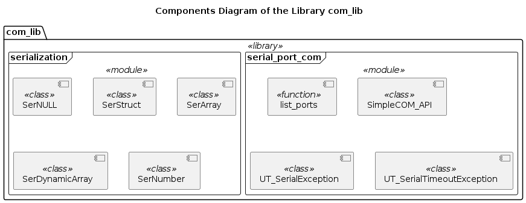

# com_lib

Python 3 implementation of an abstraction layer for the communication with a device through a (virtual) serial port. Uses multi-threading.

## Installation

### Via git

Clone the official repository into your local workspace / project folder:

```bash
$git clone <repository_path> "your projects folder"/com_lib
```

Check the system requirements and dependencies:

```bash
$cd "your projects folder"/com_lib
$python3 ./check_dependencies.py
```

Install all missing requirements and re-check, untill all requirements are met.

#### For developers only

Initialize the UML templates submodule

```bash
$cd "your projects folder"/com_lib/Documentation/UML/Templates
$git submodule init
```

Download the content of the UML templates submodule

```bash
$git submodule update --recursive --remote
```

### Via pip

You need a personal access token (with *api* scope), a deploy token (with *write_package_registry* scope) or a CI job token from GitLab. The installation command is:

```bash
pip install com_lib  --extra-index-url https://<token_name>:<token_value>@gitlab.com/api/v4/projects/25522607/packages/pypi/simple
```

The *pip* package manager should be able to find and install all missing dependencies automatically. However, the documentation is not included, only the source code and the test modules.

Please, consider using virtual enviroment in order to not mess with the global Python installation.

## System requirements

* Operational system: - any supported by the Python language developers (see [tested_OS](./Documentation/Tests/tested_OS.md)), e.g.
  * MS Windows (8, 10)
  * MacOS X
  * GNU Linux
* Python 3.6+ interpreter with the 'pip' and 'tkinter' libraries installed
  * On POSIX systems (MacOS X, Linux) comes pre-installed (*tkinter* may be required to be installed seprately from the repositories or via pip)
  * On MS Windows must be installed from https://www.python.org/downloads/windows/
* Other required Python libraries, developed at Diagnoptics (see [dependencies](./Dependencies.md)) - added automatically if this library is installed via *pip*
  * Check-out via git or download from https://gitlab.com/diagnoptics/python
  * Place them into the same project folder `"your projects folder"` side by side with this *codecs_lib* library

## Documentation

* [Requirements](./Documentation/Requirements/index.md)
* [Tests](./Documentation/Tests/index.md)
* [User and API References](./Documentation/References/index.md)

## Library components


